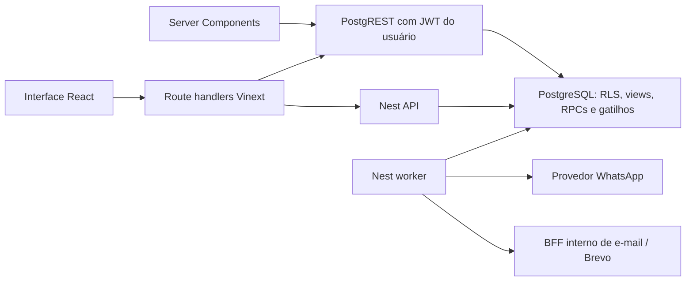

# Arquitetura do frontend

Estado do código local revisado em **16/09/2026**. Evidências de execução têm data nos relatórios; funcionalidades locais não implicam implantação em produção.

## Fluxo de dados

Leituras de negócio ficam em `src/servidor/`; consultas paginadas selecionam só os campos usados. BFF valida entrada e sessão e chama operações existentes. Transações de reserva, escala, embarque, perfil, atenção e preferências vivem em RPCs PostgreSQL. Nest atende integrações, webhooks, bot, fila e tarefas assíncronas. Detalhe dos serviços: [infraestrutura](../cecchin-pizzas-backend/infra/README.md).

Em `/admin/operacao?aba=vinculos`, responsáveis são carregados em páginas de 30. Busca por nome e filtro de contas não ligadas passam pelo BFF `GET /api/operacao/responsavel`, sob o JWT da gestão e RLS do banco; a ligação continua pela RPC `ligar_responsavel`. A leitura inicial envia apenas a primeira página. Funcionários e contas elegíveis ainda são enviados no render inicial, pois são listas pequenas no banco local; reavalie seus limites se crescerem.

Em `/admin/financeiro`, entradas e despesas pagas têm paginações independentes de 30 registros, com contagem do PostgREST. Despesas usam `pago_em` e os campos `valor_bruto`, `valor_liquido` e `tipo_pagamento` do schema atual; contas a pagar pertencem a um fluxo separado. Alterar uma página preserva a posição da outra na URL.

## Autenticação e acesso

Login sem senha oferece OTP e link com aprovação entre dispositivos. `pedido_login` associa um selector público ao pedido: o selector consulta o estado, não autoriza. O hash de uso único é validado no GoTrue e o e-mail retornado precisa corresponder ao pedido. A página de confirmação remove o segredo do fragmento e o envia ao BFF. Compatibilidade com o fluxo antigo deve ser conferida antes de remover endpoints.

A sessão é gravada nos cookies httpOnly `cecchin_acesso` e `cecchin_renovacao`. Respostas e props não contêm tokens de sessão. Cookies reduzem exposição ao JavaScript, mas não dispensam proteção contra XSS/CSRF. Logout limpa cookies e revoga a sessão; cookies inválidos passam pelo encerramento. Server Components apenas leem; o proxy renova e route handlers gravam/apagam.

Google/Apple têm fluxo PKCE, state, callback e flags de habilitação no código. Funcionamento em um ambiente depende dos provedores e URLs configurados; não considere a existência dos botões prova de ativação.

| Camada | Responsabilidade |
|---|---|
| `proxy.ts` | Tratamento/renovação de cookies e navegação para autenticação |
| `exigirSessao()` / `exigirPapel()` | Acesso à rota no servidor |
| RLS e RPCs | Organização, dono, papel e invariantes de cada operação |

Papéis: `cliente`, `staff`, `gestao`, `admin`. Admin satisfaz os guards hierárquicos existentes; permissões configuráveis, como atenção, podem usar seleção exata de papéis. A Central WhatsApp é de gestão/admin; staff usa os fluxos operacionais e links externos permitidos. O papel vem do perfil no banco, não de estado React ou claim antigo.

Policies permissivas se somam. Para a própria pessoa use o fluxo de `meu_perfil()` e filtros por dono, nunca uma consulta ampla com `limit=1`. `consultarComoServico()` fica restrito ao fluxo de pedido de login anterior à sessão; novos usos de bypass de RLS exigem justificativa e autorização explícita no código.

O primeiro admin de uma instalação precisa de bootstrap administrativo no banco após criar sua conta. Confirme ambiente, organização e ID exato; não promova contas em massa ou por um exemplo copiado da documentação.

## Navegação, agenda e pendências

`TituloNoHeader` leva títulos das páginas operacionais ao header e evita um segundo cabeçalho alto. `VoltarDinamico` mantém a cadeia de origem na sessão do navegador, incluindo filtros e página, com fallback para entrada direta.

Agenda usa filtros na URL e densidade persistida no navegador: posições 1–5 controlam colunas; posição 6 mostra a planilha, com ordenação, navegação por teclado e exportação CSV. QR de saída é recolhível; o detalhe do evento mantém o rastro da planilha compacto. `numero_do_dia` é texto de conferência, nunca chave de equipe.

**Atenção é uma flag manual.** Cobrar sinal e outras pendências são regras derivadas e não ativam essa flag. Por isso seus contadores podem divergir. Admin configura quais papéis podem marcar atenção; o banco também valida a escrita.

`Paginacao` oferece página atual, total, primeira/última e salto direto. Listas extensas preservam filtros. A lista de conversas tem paginação; o histórico de uma conversa segue a exceção descrita adiante.

## Montagem de equipe e diretório

`/admin/montar-equipe` e `/admin/operacao` usam os componentes de `src/components/equipe/` nos modos Banco e Desenho. Operação lista perfis em cards com busca/paginação; `?aba=vinculos` mantém a ligação entre usuário, responsável e funcionário. `/admin/equipe` trata contas e permissões, não substitui o perfil operacional.

O topo da montagem mostra evento, horário/endereço, base, extras, líderes e ações compactas. A grade desktop comporta dois cards de equipe e três de pessoas quando há largura. Ambas as listas ordenam forno primeiro, com avaliação como critério dentro dos grupos; ambas têm busca. A direita conta habilidades de forno e atendimento, que podem coexistir na mesma pessoa.

Adicionar individualmente uma pessoa de forno a torna líder inicialmente; o operador pode retirar essa liderança. A quantidade planejada acompanha a adição automática. Remover a liderança não apaga a habilidade de forno. Rascunhos podem ser salvos incompletos. Para confirmar, a composição deve satisfazer a quantidade de líderes planejada e as funções necessárias. Sugestões completas usam os papéis da opção calculada.

Sugestões combinam habilidades, vagas e notas; não inferem proporção das planilhas. O usuário aprovou quantidade ajustável por evento e regra configurável. A proporção demonstrativa não é default obrigatório do Banco. Preview abre por hover/clique, pode ser fixado/fechado e oferece alternativas em carrossel. Cards são arrastáveis pela superfície, preservando botões interativos. Estrelas mantêm preenchimento parcial.

Perfis abrem por botão ou contexto do card, mostram foto/avatar, habilidades, endereço, transporte e CNH. Foto ausente usa avatar ilustrado determinístico; as fotos de demonstração são arquivos locais. A edição real passa pelo BFF `/api/operacao/montagem-equipe` e RPCs. Rascunho não dispara convite; confirmação utiliza o fluxo transacional de escala.

Contrato detalhado: [dimensionamento](../cecchin-pizzas-backend/migracao/DIMENSIONAMENTO_EQUIPE.md).

## Mapas e transporte

Perfil mostra casa–QG; aberto pela montagem inclui o evento. A modal de mapa da montagem reúne opções em uma coluna com scroll e slider de densidade, sem outro preview sobreposto. MapLibre é carregado no navegador e usa worker estático.

Três dados são independentes: meios de deslocamento, veículos próprios e categorias de CNH. Uber/ônibus/empresa não significam veículo próprio; ter veículo não implica habilitação. A frota física da empresa ainda não tem entidade de alocação.

Residência fica em `perfil_operacional_equipe`, com leitura de gestão/admin; não amplie a exposição de `usuario` para guardar endereço privado. QG vem de `QG_CECCHIN` em `src/lib/operacao.ts`. O ponto do evento fica em `localizacao_evento`: escolha explícita do geocoder, gravação autorizada e uso condicionado ao endereço de referência ainda coincidir com o evento.

OSRM fornece estimativas de carro, sem trânsito ao vivo, tempo de espera ou cálculo específico de ônibus/moto. Geocoding e rota via BFF não são rastreamento GPS. A interface deve apresentar esses limites sem inventar posições.

## Minha rota, embarque e avaliações

Minha rota reúne os eventos da escala, checklist e liberação por QR. `/operacional/checklist` redireciona; a antiga página `/operacional/escala` foi removida, mas a API de respostas à escala continua necessária.

QR não substitui login. A operação exige acesso à organização e escala aceita ou papel gestor. Banco trava o evento para validar checklist e liberação, revoga códigos ao cancelar/transferir e mantém registro de autor/horário. Reconferir saída é idempotente.

Cliente pode avaliar evento e integrantes elegíveis pelo fluxo de encerramento. Notas novas aceitam 0–5; não confundir com o ETL histórico que tratou zero da planilha como ausência de avaliação.

## Notificações e WhatsApp

Configurações têm abas e cards de destinatários com grupos visuais Canais (e-mail/WhatsApp) e Avisos. Seleção atravessa páginas/filtros, mantém contador e edita em lote pela barra inline. RPC aceita até 1000 IDs, valida todos antes de escrever e preserva campos omitidos. Telefone não faz parte do lote.

**A Central usa dados reais mesmo no modo Desenho.** Histórico inicia no fim, carrega lotes de 100–200 mensagens ao rolar para cima e preserva a âncora. Cursor usa data/hora e ID. Botão para descer aparece ao sair do fim; novas mensagens indicam atividade sem deslocar quem está lendo. Não reinstalar um paginator acima da conversa.

Central mantém atendimento humano/bot, fila de envio, mídias autorizadas e ocultação de conversa sem apagar histórico. WhatsApp Web e Meta têm contratos diferentes de envio/janela/templates. Consulte a [integração](../cecchin-pizzas-backend/infra/WHATSAPP_INTEGRACAO.md) antes de alterar.

## Desempenho e evidências

`TabelasOperacionais` recebe DTOs compactos para evitar repetir a árvore server de cada célula. Consulta e autorização continuam no servidor. Isso troca parte do payload RSC por código de apresentação no cliente; meça ambas as parcelas. Avatares/conteúdo de cards e opções de sugestão têm memoização; resize do mapa não deve reajustar enquadramento durante arraste.

A redução do payload RSC deve ser medida por bytes, latência e custo no cliente; não há teto útil de linhas. Não foi medida uma comparação de build de produção para esta revisão.

## Limites atuais

Frota física, upload de foto/Storage e emissão de GPS continuam ausentes. Checkout hospedado da InfinitePay, aprovação manual e devolução registrada estão implementados localmente. A disponibilidade de cobrança real depende da configuração e do serviço em execução no ambiente; consulte o [contrato de pagamentos](../cecchin-pizzas-backend/infra/INFINITEPAY.md). Banco e Desenho compartilham componentes de equipe, mas o volume e os dados disponíveis diferem.

Veja os [procedimentos de verificação](TESTES.md) e o [backend](../cecchin-pizzas-backend/README.md).
